<p align="center"></p>

<p align="center">
<a href="LICENSE"></a>


</p>

# speedread

**`Read` is the wrong abstraction for coding agents.** Agent file reading should be adaptive, stateful, symbol-aware and token-budgeted instead of byte-oriented. ripgrep returns matches; `cat` returns bytes. speedread returns *the minimum useful unit of code for the question*: a function instead of a file, a skeleton instead of a truncated page, a changed-symbol diff instead of a re-read.

It is an MCP server and CLI (Rust, built for macOS on Apple Silicon) with four primitives:

| | | |
|---|---|---|
| **map** | locate structure | budgeted repo tree with line counts, importance-weighted; top-level symbols on request |
| **search** | locate text | ripgrep's engine; every hit grouped under its enclosing function or class, with line range |
| **trace** | locate relationships | callers, callees, references, implementations: syntactic and receiver-aware |
| **read** | obtain exact evidence | batched targets and `path#Symbol`s under one token budget; `path@etag` returns only what changed |

## Watch one real task

<p align="center"></p>

Recorded eval transcripts, replayed at recorded speed; all three trials of each condition behaved identically. The built-in `grep` answers with a file name, so the agent has to ask again, twice. speedread's `search` answers with the matching lines under their enclosing declaration. Full interactive report: [`demo/index.html`](demo/index.html) (self-contained; open it locally), generated by [`demo/build.py`](demo/build.py) from [`evals/results/`](evals/results/).

## Results

Every number below comes from an eval in [`evals/`](evals/README.md), built to Anthropic's [*Demystifying evals for AI agents*](https://www.anthropic.com/engineering/demystifying-evals-for-ai-agents): explicit tasks, repeated trials, deterministic outcome graders, pass@k and pass^k, balanced task sets with controls, isolated trials and transcripts read. Raw data, every transcript included, is committed.

### Real agent, same model, same harness

<p align="center"></p>

The setup: 10 code questions over 6 repositories and 5 languages, 3 trials each, claude-sonnet-5 via GitHub Copilot CLI, with tokens and cost taken from the harness's own per-call usage log ([Suite 3](evals/RESULTS.md#suite-3--real-agent-code-questions)).

- **Where the savings come from:** round trips, not bytes. Every model call re-sends the system prompt, tool definitions and conversation (~21k tokens here), and tool results were about the same size in both conditions. An answer in one call instead of three is two fewer full round trips.
- **Adoption is part of the product.** Merely *installed* next to the built-in tools, speedread was used in **0 of 10** trials, matching [CodeCompass](https://arxiv.org/abs/2602.20048)'s finding that agents ignore better tools. As *the* reader, it was used in 27 of 30 trials; the 3 exceptions were a 41-line `go.mod`, where the agent ran `cat`. See [Make it the reader](#make-it-the-reader).

### Coding tasks (SWE-style)

[Suite 4](evals/RESULTS.md#suite-4--real-agent-coding-tasks) injects real regressions into gin (Go) and flask (Python), hands the agent a symptom-only bug report and grades by the repository's **full test suite, with tests unmodified**. Every task is verified to fail as injected and to pass with the reference fix. There are four conditions: built-in tools, speedread *available*, speedread *preferred* and speedread *exclusive*. They measure pass rate, tokens, model time, turns, repeated source bytes, adoption, and whether a skeleton ever hid the decisive line.

**Status:** the baseline arm is complete: 16 trials, **100% pass**, 166k input tokens, 7.8 model calls and 7.84 AIU per task on average. The three speedread arms are not run yet. The baseline already shows where agent cost lives: read and search results averaged **1,604 tokens per task, about 1% of input**. The other 99% is conversation re-sent across ~8 round trips. The lever is fewer round trips, which is what the Q&A suite measured.

### Tool level

<p align="center"></p>

[Suite 1](evals/RESULTS.md#suite-1--tool-scenarios) covers 35 reading scenarios on real repositories. Each is **graded for information sufficiency**: a smaller answer that drops what the task needs fails. It shows what the primitives compress, and several comparisons are structurally favorable: whole-file reads and 2,000-line paging. The fair comparison is the *best-case* baseline, which greps for the name and reads exactly the function: **−46%**, in one call instead of two. The real-agent suites above are the evidence for agent performance.

### The budget contract

<p align="center"></p>

Budgets are in tokens, but no client tells a server its tokenizer. [Suite 2](evals/RESULTS.md#suite-2--budget-contract) attacks the estimator with SVG path data, JSON, lockfiles, minified JS, real CJK docs, emoji, base64, hex dumps and numeric tables. Under o200k, cl100k and the legacy Claude tokenizer, a fixed 2.6 bytes/token put **9.5%** of reads over budget, the worst at 1.81×. The content-aware estimator ([`src/tokens.rs`](src/tokens.rs)) models tokens from character classes and is fitted to the stricter of o200k and legacy Claude. It puts **0 of 525** reads over budget (worst 0.99×).

**Calibrated against a production tokenizer.** Offline tokenizers are proxies. The harness logs exact input tokens per model call, so the real cost of each tool result can be recovered from consecutive calls ([Suite 2b](evals/tokenizer_calibration.py)). On **claude-sonnet-5**, real counts run **1.22× the estimate at the median**, and 1.36× for speedread's own output, which matches Anthropic's note that Claude 4.7+ tokenizers produce ~30% more tokens. Clients that identify as Claude therefore get a **Claude profile** that scales budgets 1.4×. Force it anywhere with `SPEEDREAD_TOKENIZER=claude`; `openai` and `legacy` are the other profiles.

### Speed

Speed is not the headline; returning less is. It still matters that doing *more* work per call, like parsing, grouping and budgeting, doesn't cost latency. Measured on an Apple M4 (4P + 6E cores), warm cache, medians:

| Task | speedread | ripgrep default | ripgrep `-j4` |
|---|---:|---:|---:|
| Walk vscode (19,167 files) **with sizes and mtimes** | **26 ms** | 29 ms (names only) | 30 ms |
| Search vscode for a literal | 103 ms | 294 ms | **109 ms** |
| Read a 742 KB, 21k-line `.d.ts` → skeleton (cold process) | 17 ms | | |
| `#createDecorator` definition lookup across vscode | 332 ms | | |

Search runs at parity with ripgrep when ripgrep is told to use only the performance cores. The 2.9× gap to ripgrep's default comes from threads spilling onto efficiency cores on this chip: kernel time grows 6.6×. speedread sizes its pool from `hw.perflevel0.logicalcpu`.

## The primitives

### `read`: batched, budgeted, symbol-aware

One call takes any mix of targets. They share one token budget (default 8,000).

| Target | Returns |
|---|---|
| `src/app.ts` | The whole file. If it doesn't fit, a **skeleton**: signatures, types and docs, with bodies collapsed as `A-B ⋯`. If that's still too big, an **outline**. Never a blind cut. |
| `src/app.ts:120-180`, `src/app.ts:120` | Those lines; a single line (or `file:line:col` from a compiler error) returns the enclosing function or class. |
| `src/app.ts#handleRequest`, `#Server.start` | That symbol's full source, including docs and decorators. `#Name` alone finds the definition anywhere. |
| `README.md#Install`, `package.json#scripts` | A Markdown section, or a JSON, YAML or TOML key. |
| `src/**/*.test.ts` | A glob (.gitignore-aware); large sets degrade largest-first. |
| `src/app.ts@<etag>` | **Only what changed** since the version whose etag appeared in a header. |

A real skeleton of flask's 1,628-line `app.py` (excerpt) costs 3.4k tokens, against 21k for the file:

```
==> src/flask/app.py @… (1,628 lines) [skeleton]
110	class Flask(App):
111	    """The flask object implements a WSGI application and acts as the central
112-205	    ⋯
366	    def get_send_file_max_age(self, filename: str | None) -> int | None:
367	        """Used by :func:`send_file` to determine the ``max_age`` cache
368-391	        ⋯
```

**Symbol-aware re-reads.** After an edit, `path@etag` returns `unchanged`, the appended tail for a growing log, or a diff that names what changed. Hunks carry git-style function context, and `mode=outline` returns only the symbol summary. From [`tests/mcp.rs`](tests/mcp.rs):

```
==> src/lib.rs @… (was @…): 1 hunk, +1 -1, now 131 lines
symbols:
  add [1-7]: body changed, signature unchanged
@@ -2,5 +2,5 @@ add
 pub fn add(a: i32, b: i32) -> i32 {
     let c = a + b;
-    let d = c;
+    let d = c * 2;
     let e = d;
```

A signature edit reads ``f3 [25-27]: signature changed: `pub fn f3() -> u32` → `pub fn f3(k: u32) -> u32` ``; a new function reads ``g [133-135]: added `pub fn g() -> u8` ``.

**Etags are 64-bit.** An etag is the full 64-bit xxh3 of the content, printed as 16 hex digits, and snapshots of what the agent has seen live in a 256 MB LRU keyed by it. Two *different* contents would have to collide in 64 bits to alias. Across 100,000 snapshots in one session that chance is about 3 × 10⁻¹⁰. Identical contents share an etag, which is correct. Shorter tags are rejected rather than prefix-matched.

### `search`: hits grouped by enclosing symbol

```
==> src/flask/helpers.py @… (4 matches)
[200-251] def url_for(endpoint: str, *, _anchor: str | None = None, _method: str | None = None, …) -> str
200	def url_for(
212	    :meth:`current_app.url_for() <flask.Flask.url_for>`. See that method
244	    return current_app.url_for(
```

`output=symbols` returns the full source of every enclosing function in the same call. `output=files` returns paths with counts.

### `trace`: relationships, not text

The expensive agent loop is search → open → search again to follow a call chain. `trace` does it in one call. Real output on gin (abridged):

```
$ speedread trace '#AbortWithStatus' --depth 2
==> callers of Context.AbortWithStatus (context.go:221-227)
func (c *Context) AbortWithStatus(code int)
14 call sites in 14 functions · syntactic: comments, strings and the definition excluded
context.go
  [245-251] func (c *Context) AbortWithError(code int, err error) *Error
    249	c.AbortWithStatus(code)
      ← [820-828] func (c *Context) BindUri(obj any) error
        824	c.AbortWithError(http.StatusBadRequest, err).SetType(ErrorTypeBind) //nolint: errcheck
…
$ speedread trace Render.Render --direction impls
==> implementations of Render.Render (render/render.go:11-12)
Render(http.ResponseWriter) error
19 implementations of Render · syntactic: types whose method sets cover the interface
  render/bson.go [13-16] type BSON
    [20-29] func (r BSON) Render(w http.ResponseWriter) error
  render/data.go [12-16] type Data
    [18-26] func (r Data) Render(w http.ResponseWriter) (err error)
…
```

Its four directions:

- `callers`: call sites grouped by calling function; `depth` 2–3 builds the tree.
- `callees`: each call in the body, resolved to its definition.
- `refs`: every use, including imports and type mentions.
- `impls`: subclasses and trait, protocol and interface implementations. Go interfaces are matched structurally, by method sets. A method target lists each override.

Comments and strings are excluded by tree-sitter. Same-named definitions are told apart by receiver, enclosing class, Go package and file. Sites that stay ambiguous are marked `?`, never silently merged. It is syntactic, with no type inference. See [Limitations](#limitations-and-roadmap).

### `map`: a budgeted overview

A .gitignore-aware tree with line counts. Directories expand by importance until the budget (default 3,000) is spent: source first, then hidden, test or vendored trees. `symbols=true` adds each file's top-level definitions. Symlinks are listed as `name → target` and never followed.

### Code execution and Skills

Anthropic's [*Code execution with MCP*](https://www.anthropic.com/engineering/code-execution-with-mcp) argues for filtering data before it reaches the model. The four tool definitions cost **~1.4k tokens** in total. The CLI mirrors them and adds JSON Lines for agents that script:

```sh
speedread symbols src --json | jq -r 'select(.kind=="function" and .end-.start>80) | "\(.path):\(.start) \(.qualified)"'
speedread search 'TODO' --json | jq -r .path | sort | uniq -c | sort -rn | head
speedread map --json | jq -s 'map(select(.lines != null)) | sort_by(-.lines) | .[:10]'
```

[`skills/speedread/SKILL.md`](skills/speedread/SKILL.md) packages the workflow as an Agent Skill.

## Make it the reader

Availability is not adoption. Configure speedread as the reader, not as one option among many.

**GitHub Copilot CLI:** add the server, then remove the built-in readers. Edit and bash stay.
```sh
copilot mcp add speedread -- speedread mcp
copilot --excluded-tools view grep glob
```

**Claude Code:**
```sh
claude mcp add --scope user speedread -- speedread mcp
claude --disallowedTools Grep Glob     # keep Read: Edit requires it
```

> **Claude Code caveat, quantified.** Claude Code's `Edit`/`Write` require a prior native `Read` of the file; MCP reads don't count ([claude-code#32214](https://github.com/anthropics/claude-code/issues/32214)). speedread can't remove that read. Across the 8 coding tasks, a full default `Read` of the edited file costs **2k–21k tokens (median 9.8k)**. It is paid once, then re-sent (mostly as cache reads) on every later turn. A ranged `Read` of the edit site is likely enough to satisfy the check, but that's unverified. So speedread's savings in Claude Code are its exploration savings minus this cost, not the full numbers above.

**VS Code, Cursor, Codex, Gemini CLI, Zed, Claude Desktop:** see [configuration](#configuration). Add this to `AGENTS.md`, `CLAUDE.md` or `.github/copilot-instructions.md`:

```markdown
## Reading code
Use the speedread MCP tools to read, search and navigate code; use built-in tools only to edit and run commands.
- `read` everything you need (files, `path:A-B`, `path#Name`, `#Name`) in ONE call; expand skeletons with `path#Name`.
- `search` finds text (hits show their enclosing function); `trace` follows callers, callees and implementations.
- After editing, `read path@etag` to see only what changed.
```

## Install

Requires Rust 1.90+ (`brew install rust` or [rustup](https://rustup.rs)).

```sh
cargo install --git https://github.com/brennengreen/speedread   # or: cargo install --path .
```

This installs one native binary, `~/.cargo/bin/speedread`, with no runtime dependencies.

## Configuration

speedread serves MCP over stdio (`speedread mcp`). Workspace roots come from `--root <dir>` (repeatable), then `$CLAUDE_PROJECT_DIR`, then the client's MCP roots (VS Code/Cursor folders, Claude Code `--add-dir`), then the current directory. Usually no flags are needed.

| Client | Config |
|---|---|
| VS Code (`.vscode/mcp.json`) | `{ "servers": { "speedread": { "type": "stdio", "command": "speedread", "args": ["mcp"] } } }` |
| Cursor (`~/.cursor/mcp.json`) | `{ "mcpServers": { "speedread": { "command": "speedread", "args": ["mcp"] } } }` |
| Codex CLI (`~/.codex/config.toml`) | `[mcp_servers.speedread]` · `command = "speedread"` · `args = ["mcp"]` |
| Gemini CLI (`~/.gemini/settings.json`) | `{ "mcpServers": { "speedread": { "command": "speedread", "args": ["mcp"] } } }` |
| Zed (`settings.json`) | `{ "context_servers": { "speedread": { "source": "custom", "command": "speedread", "args": ["mcp"] } } }` |
| Claude Desktop | absolute binary path, plus `"args": ["mcp", "--root", "/path/to/project"]` |

GUI apps may not inherit your shell's `PATH`; use the absolute path from `which speedread`.

Environment variables:
- `SPEEDREAD_TOKENIZER=claude|openai|legacy` pins the budget calibration (default: detect from the client, else `legacy`).
- `SPEEDREAD_THREADS` sets the worker count (default: performance cores).
- `SPEEDREAD_WALKER=portable` uses the portable walker.

## How it works

- **Budget ladder.** Each target has four views: full, skeleton, compact skeleton (comment, docstring and import runs folded) and outline. Items degrade largest-first until the batch fits: exploratory targets before requested symbols, and explicit ranges never. A final outline keeps every top-level symbol and fills in members breadth-first. Responses are sized with the content-aware estimate, then checked once more before they're sent. The maximum budget (10k) keeps results inline in every client: Copilot CLI spills results over 30 KB to a file, and Claude Code warns above 10k tokens.
- **Outlines.** tree-sitter covers Rust, Python, JavaScript, TypeScript/TSX, Go, Java, C, C++, C#, Ruby, PHP, Bash, Swift, Kotlin, Scala, Lua and Objective-C. Single-pass scanners handle Markdown, JSON, YAML and TOML. Apple SDK macros are blanked before parsing Objective-C and C headers; otherwise tree-sitter's error recovery drops the rest of the file.
- **Caches.** Sources are validated by (size, mtime ns, inode, device) on every access. Outlines are cached by content hash, and the long-lived MCP process keeps both warm.
- **macOS.**
  - A `getattrlistbulk(2)` walker gets name, type, size, mtime and flags for a batch of entries in one syscall: 1.8× faster than readdir+lstat.
  - Worker pools are sized to the performance cores, at `QOS_CLASS_USER_INITIATED`.
  - iCloud dataless files fail fast instead of downloading (`IOPOL_TYPE_VFS_MATERIALIZE_DATALESS_FILES`).
  - The 256-descriptor soft limit that launchd gives GUI-spawned processes is raised.
  - No mmap for cached files: SIGBUS when editors truncate in place.
  - NEON `memchr`, `simdutf8`, `xxh3` and `mimalloc`.

The research behind every design choice, with sources, is in [docs/RESEARCH.md](docs/RESEARCH.md).

## Limitations and roadmap

- **`trace` is syntactic.** It uses tree-sitter plus name resolution by receiver, class and package, with no type inference, so `x.f()` on an unknown receiver matches every `f`, marked `?`. The next step is an **optional LSP/SCIP layer** behind the same `trace` interface for exact references, overrides and call hierarchies.
- **Adoption experiments.** Tool names, descriptions and schema shapes will be A/B tested for unprompted adoption, along with a single high-level `context` tool that picks map, search, trace or read itself.
- **The coding eval's speedread arms** (available / preferred / exclusive) are pending. The harness and verified tasks are committed; `evals/RESULTS.md` has the command.
- Budgets are estimates, not tokenizer counts. They are calibrated to offline tokenizers, plus the Claude profile from production counts.
- Built and tuned for macOS on Apple Silicon. Other Unix systems use the portable walker, untested in CI. Windows is not supported.

## Security

Read-only by construction: there are no write tools. Paths are canonicalized and must lie inside a root. Dependency caches (`~/.cargo/registry`, `~/go/pkg/mod`, SwiftPM checkouts, SDKs) are readable; `--no-deps` turns that off and `--unrestricted` lifts all path limits. macOS privacy protections still apply.

## Development

```sh
cargo test                                      # unit, MCP protocol and outline snapshot tests
UPDATE_SNAPSHOTS=1 cargo test --test outlines   # after an intentional outline change
python3 evals/tool_eval.py <bench> --speedread target/release/speedread --rg rg
python3 demo/build.py                           # regenerate the demo and README charts from evals/results
```

## License

MIT © 2026 Brennen Green
