<p align="center"></p>

<p align="center">
<a href="https://github.com/brennengreen/speedread/actions/workflows/ci.yml"></a>
<a href="LICENSE"></a>


</p>

# speedread

**Token-efficient code search and navigation for AI coding agents.** speedread is an MCP server and CLI that gives Claude Code, GitHub Copilot, Codex, Cursor, Gemini CLI and other agents the part of a codebase a question needs, within a token budget: the function around each search hit, a large file's skeleton, a symbol's callers and implementations, or only what changed since the last read. Not whole files and bare grep hits.

**`Read` is the wrong abstraction for coding agents.** Agent code reading should be adaptive, stateful, symbol-aware and token-budgeted instead of byte-oriented. Every model call re-sends the system prompt, tool definitions and conversation so far (18–21k tokens before any code, in our evals), so an agent's cost is driven more by round trips than by bytes. ripgrep returns matches and `cat` returns bytes, so the agent asks again: open the file, find the function, search for the next hop. speedread returns *the minimum useful unit of code for the question*, with enough structure that the next call often isn't needed.

| The agent needs | Built-in tools return | speedread returns |
|---|---|---|
| where something is | file names, or bare matching lines | each hit under its enclosing function or class, with its line range (`search`) |
| one function in a large file | the file in 2,000-line pages, or a guessed range | that symbol's full source (`read path#Symbol`), or a skeleton of the file |
| callers, callees, implementations | a search per hop, then more reads | the relationship in one call, up to three levels deep (`trace`) |
| a file again, after an edit | the file again | only what changed, labelled by symbol (`read path@etag`) |

<p align="center"></p>

One of the ten code-question tasks, replayed from its recorded eval transcripts at recorded speed; all three trials of each condition behaved identically. The built-in `grep` answers with a file name, so the agent has to ask again, twice. speedread's `search` answers with the matching lines under their enclosing declaration. This is the second-largest saving of the ten tasks; two tasks came out about 1% worse, and across all ten, input tokens fell 35%. Full interactive report: [`demo/index.html`](demo/index.html) (self-contained; open it locally), generated by [`demo/build.py`](demo/build.py) from [`evals/results/`](evals/results/).

## Measured, not hand-waved

Real agents on real repositories, with the same model (claude-sonnet-5) and harness (GitHub Copilot CLI) in both arms: built-in tools vs speedread as the reader. Every trial, transcript, grader and diff is committed, including the workloads where speedread didn't help.

| Workload (real agent, same model and harness) | Trials per arm | Input tokens | Model time (median) | Quality |
|---|---:|---:|---:|---|
| **Code questions**: find, read, answer | 30 | **−35%** (95% CI −45 to −23%) | **−47%** | pass^3 90% → **100%** |
| **Relationship questions**: callers, callees, implementations | 8 | **−57%** (CI −74 to −20%) | −34% (not significant) | 100% → 100% |
| **Bug fixes**: find, edit, run the test suite (with guidance · exclusive) | 16 | −3% · −1% (not significant) | −24% · −27% (not significant) | 100% → 100%; compression never hid the bug |
| **Installed but not made the reader** (Q&A · bug fixes) | 10 · 16 | **+31% · +46%** (higher on 9 of 10 · 8 of 8 tasks) | — | used in **0 of 26** trials |

- **Round trips drive the savings.** speedread saves where it removes model calls: answers with enclosing context, batched reads, `trace` in one hop. On bug fixes, editing and testing dominate the turns, and read results were about 1% of input, so tokens barely moved.
- **Adoption decides everything.** An unused MCP server is not free: its tool definitions ride along on every call (+2.2k tokens per call, measured). Configure it as [the reader](#make-it-the-reader).
- **Scope.** One model in one harness, and the relationship and bug-fix suites are small. Other clients and models are untested; treat these numbers as evidence for this setup, not a promise for yours.

pass^3 is the share of tasks whose three trials all passed. Intervals are 95% bootstrap intervals on the ratio of means ([`evals/stats.py`](evals/stats.py)). Per-suite detail: [Results](#results) · method: [`evals/README.md`](evals/README.md) · every table: [`evals/RESULTS.md`](evals/RESULTS.md) · raw trials and transcripts: [`evals/results/`](evals/results/)

## Quick start

**1. Install** (macOS on Apple Silicon, Rust 1.90+; a clean build took 80 s on an M4, plus downloads):

```sh
cargo install --locked --git https://github.com/brennengreen/speedread
```

Prebuilt binaries, other platforms, and why not `brew install speedread`: [Install](#install).

**2. Add it to your agent as the reader, not as one more tool.** Installed alongside the built-in tools with no guidance, it went unused and made runs more expensive ([above](#measured-not-hand-waved)).

```sh
# GitHub Copilot CLI: add the server, then remove the built-in readers (edit and bash stay)
copilot mcp add speedread -- speedread mcp
copilot --excluded-tools view grep glob

# Claude Code: keep Read, because Edit requires it
claude mcp add --scope user speedread -- speedread mcp
claude --disallowedTools Grep Glob
```

VS Code, Cursor, Codex, Gemini CLI, Zed and Claude Desktop: [Configuration](#configuration). Where the built-in tools can't be removed, add the [reading instructions](#make-it-the-reader) to `AGENTS.md`, `CLAUDE.md` or `.github/copilot-instructions.md`.

**3. Or try it by hand** in any repository:

```sh
speedread map --symbols                      # structure, with each file's top-level definitions
speedread search 'handleRequest'             # hits grouped under their enclosing function
speedread trace '#handleRequest' --depth 2   # callers of callers; --direction callees|refs|impls
speedread read 'src/app.ts#Server.start' src/util.ts:40-80   # several targets, one call, one budget
```

## The primitives

Four tools over MCP, mirrored by the CLI:

| Primitive | Job | Returns |
|---|---|---|
| **map** | locate structure | budgeted repo tree with line counts, importance-weighted; top-level symbols on request |
| **search** | locate text | ripgrep's engine; every hit grouped under its enclosing function or class, with line range |
| **trace** | locate relationships | callers, callees, references, implementations: syntactic and receiver-aware |
| **read** | obtain exact evidence | batched targets and `path#Symbol`s under one token budget; `path@etag` returns only what changed |

### `read`: batched, budgeted, symbol-aware

One call takes any mix of targets. They share one token budget (default 8,000).

| Target | Returns |
|---|---|
| `src/app.ts` | The whole file. If it doesn't fit, a **skeleton**: signatures, types and docs, with bodies collapsed as `A-B ⋯`. If that's still too big, an **outline**. Never a blind cut. |
| `src/app.ts:120-180`, `src/app.ts:120` | Those lines; a single line (or `file:line:col` from a compiler error) returns the enclosing function or class. |
| `src/app.ts#handleRequest`, `#Server.start` | That symbol's full source, including docs and decorators. `#Name` alone finds the definition anywhere. |
| `README.md#Install`, `package.json#scripts` | A Markdown section, or a JSON, YAML or TOML key. |
| `src/**/*.test.ts` | A glob (.gitignore-aware); large sets degrade largest-first. |
| `src/app.ts@<etag>` | **Only what changed** since the version whose etag appeared in a header. |

A real skeleton of flask's 1,628-line `app.py` (excerpt) costs 3.4k tokens, against 21k for the file:

```
==> src/flask/app.py @… (1,628 lines) [skeleton]
110	class Flask(App):
111	    """The flask object implements a WSGI application and acts as the central
112-205	    ⋯
366	    def get_send_file_max_age(self, filename: str | None) -> int | None:
367	        """Used by :func:`send_file` to determine the ``max_age`` cache
368-391	        ⋯
```

**Symbol-aware re-reads.** After an edit, `path@etag` returns `unchanged`, the appended tail for a growing log, or a diff that names what changed. Hunks carry git-style function context, and `mode=outline` returns only the symbol summary. From [`tests/mcp.rs`](tests/mcp.rs):

```
==> src/lib.rs @… (was @…): 1 hunk, +1 -1, now 131 lines
symbols:
  add [1-7]: body changed, signature unchanged
@@ -2,5 +2,5 @@ add
 pub fn add(a: i32, b: i32) -> i32 {
     let c = a + b;
-    let d = c;
+    let d = c * 2;
     let e = d;
```

A signature edit reads ``f3 [25-27]: signature changed: `pub fn f3() -> u32` → `pub fn f3(k: u32) -> u32` ``; a new function reads ``g [133-135]: added `pub fn g() -> u8` ``.

**Etags are 64-bit.** An etag is the full 64-bit xxh3 of the content, printed as 16 hex digits, and snapshots of what the agent has seen live in a 256 MB LRU keyed by it. Two *different* contents would have to collide in 64 bits to alias. Across 100,000 snapshots in one session that chance is about 3 × 10⁻¹⁰. Identical contents share an etag, which is correct. Shorter tags are rejected rather than prefix-matched.

### `search`: hits grouped by enclosing symbol

```
$ speedread search 'def url_for|current_app.url_for\(' src/flask/helpers.py
3 matches in 1 file for /def url_for|current_app.url_for\(/
==> src/flask/helpers.py @5dc322f9c9cf99f2 (3 matches)
[200-251] def url_for(endpoint: str, *, _anchor: str | None = None, _method: str | None = None, _scheme: str | None = None, _external: bool | None = None, **values: t.Any) -> str
200	def url_for(
212	    :meth:`current_app.url_for() <flask.Flask.url_for>`. See that method
244	    return current_app.url_for(
```

`output=symbols` returns the full source of every enclosing function in the same call. `output=files` returns paths with counts.

### `trace`: relationships, not text

The expensive agent loop is search → open → search again to follow a call chain. `trace` does it in one call. Real output on gin (abridged):

```
$ speedread trace '#AbortWithStatus' --depth 2
==> callers of Context.AbortWithStatus (context.go:221-227)
func (c *Context) AbortWithStatus(code int)
14 call sites in 14 functions · syntactic: comments, strings and the definition excluded
context.go
  [245-251] func (c *Context) AbortWithError(code int, err error) *Error
    249	c.AbortWithStatus(code)
      ← [820-828] func (c *Context) BindUri(obj any) error
        824	c.AbortWithError(http.StatusBadRequest, err).SetType(ErrorTypeBind) //nolint: errcheck
…
$ speedread trace Render.Render --direction impls
==> implementations of Render.Render (render/render.go:11-12)
Render(http.ResponseWriter) error
19 implementations of Render · syntactic: types whose method sets cover the interface
  render/bson.go [13-16] type BSON
    [20-29] func (r BSON) Render(w http.ResponseWriter) error
  render/data.go [12-16] type Data
    [18-26] func (r Data) Render(w http.ResponseWriter) (err error)
…
```

Its four directions:

- `callers`: call sites grouped by calling function; `depth` 2–3 builds the tree.
- `callees`: each call in the body, resolved to its definition.
- `refs`: every use, including imports and type mentions.
- `impls`: subclasses and trait, protocol and interface implementations. Go interfaces are matched structurally, by method sets. A method target lists each override.

Comments and strings are excluded by tree-sitter. Same-named definitions are told apart by receiver, enclosing class, Go package and file. Sites that stay ambiguous are marked `?`, never silently merged. It is syntactic, with no type inference. See [Limitations](#limitations-and-roadmap).

### `map`: a budgeted overview

A .gitignore-aware tree with line counts. Directories expand by importance until the budget (default 3,000) is spent: source first, then hidden, test or vendored trees. `symbols=true` adds each file's top-level definitions. Symlinks are listed as `name → target` and never followed.

### Code execution and Skills

Anthropic's [*Code execution with MCP*](https://www.anthropic.com/engineering/code-execution-with-mcp) argues for filtering data before it reaches the model. The four tool definitions cost **~1.4k tokens** in total. The CLI mirrors them and adds JSON Lines for agents that script:

```sh
speedread symbols src --json | jq -r 'select(.kind=="function" and .end-.start>80) | "\(.path):\(.start) \(.qualified)"'
speedread search 'TODO' --json | jq -r .path | sort | uniq -c | sort -rn | head
speedread map --json | jq -s 'map(select(.lines != null)) | sort_by(-.lines) | .[:10]'
```

[`skills/speedread/SKILL.md`](skills/speedread/SKILL.md) packages the workflow as an Agent Skill.

## Results

Every number here comes from an eval in [`evals/`](evals/README.md), built to Anthropic's [*Demystifying evals for AI agents*](https://www.anthropic.com/engineering/demystifying-evals-for-ai-agents): explicit tasks, repeated trials, deterministic outcome graders, pass@k and pass^k, balanced task sets with controls, isolated trials and transcripts read. Raw data, every transcript included, is committed. All agent trials use claude-sonnet-5 via GitHub Copilot CLI, with exact token counts from the harness's usage log. The [summary table](#measured-not-hand-waved) covers all four real-agent workloads, not just the best one.

### Code questions

<p align="center"></p>

[Suite 3](evals/RESULTS.md#suite-3--real-agent-code-questions): 10 questions with version-specific answers, over 6 repositories and 5 languages, with 3 trials each. Cost fell on 10 of 10 tasks, and tool results were about the same size in both conditions: the saving is two fewer round trips per answer. As *the* reader, speedread was used in 27 of 30 trials; the 3 exceptions were a 41-line `go.mod`, which the agent read with `cat`. This suite ran before `trace`, symbol diffs and the content-aware estimator existed.

### Relationship questions

<p align="center"></p>

[Suite 3b](evals/RESULTS.md#suite-3b--real-agent-relationship-questions) asks for two-hop callers, resolved callees, Go interface implementations (structural) and Rust trait implementations. Two of the four are answerable with one good grep; they are the controls. Unprompted, the agent chose `trace` in 7 of 8 trials. On the two-hop question, built-in tools took 7–14 tool calls and 186k–277k tokens. With speedread, the agent called `trace` with `depth: 2`, checked one more function and answered: 2 calls, 61k tokens. The sample is small (8 trials per arm), so treat the size of the effect as approximate.

Transcript review changed this suite's grader. Both baseline trials of the two-hop task excluded `BasicAuth`, arguing that its `AbortWithStatus` call sits inside the closure `BasicAuthForRealm` returns, which the router invokes as a value. That is a defensible reading, so the grader now accepts both answers. `trace` attributes calls inside closures to the enclosing named function; this is listed under limitations.

### Bug fixes (SWE-style)

<p align="center"></p>

[Suite 4](evals/RESULTS.md#suite-4--real-agent-coding-tasks) injects 8 real regressions into gin (Go) and flask (Python), gives the agent a symptom-only bug report and grades by the repository's **full test suite, with tests unmodified**. Every task is verified to fail as injected and to pass with the reference fix. The four conditions are:

- *baseline*: built-in tools only
- *available*: speedread installed, no guidance
- *preferred*: one sentence asking the agent to use it for reading
- *exclusive*: built-in view/grep/glob removed; edit and bash stay

That is 64 trials:

- **No quality cost.** 64 of 64 trials passed. Compression never hid the bug: in 0 of the 32 trials that used speedread was the file with the bug first shown as a skeleton or outline before the buggy line itself. Agents searched first and then read exact ranges.
- **Adoption is binary.** *Available* was chosen in 0 of 16 trials, yet it used more input tokens than baseline on 8 of 8 tasks (+46%; cost +30%). One sentence of guidance took adoption to 16 of 16, with 78% of reads done through speedread.
- **Fewer turns and less time; tokens flat.** *Preferred* took fewer model calls on 7 of 8 tasks (median 5 instead of 6) and 24% less model time. *Exclusive* took 27% less model time, lower on 7 of 8 tasks. Cost fell 4–6%, but input tokens stayed within noise (−3%, −1%). With 16 trials per arm none of these intervals exclude zero, so read them as directions ([stats](evals/RESULTS.md#suite-4--real-agent-coding-tasks)).
- **Not observed:** the "same success at 50–90% less context" a reviewer hoped for. It holds where reading dominates the turns, and not on short edit-and-test loops.
- `trace` was never called in these 32 trials: fixing a bug from its symptom needed search and read, not a call graph.

### Tool level

<p align="center"></p>

[Suite 1](evals/RESULTS.md#suite-1--tool-scenarios) covers 35 reading scenarios on real repositories. Each is **graded for information sufficiency**: a smaller answer that drops what the task needs fails. It shows what the primitives compress, and several comparisons are structurally favorable: whole-file reads and 2,000-line paging. The fair comparison is the *best-case* baseline, which greps for the name and reads exactly the function: **−46%**, in one call instead of two. The real-agent suites above are the evidence for agent performance.

### The budget contract

<p align="center"></p>

Budgets are in tokens, but no client tells a server its tokenizer. [Suite 2](evals/RESULTS.md#suite-2--budget-contract) attacks the estimator with SVG path data, JSON, lockfiles, minified JS, real CJK docs, emoji, base64, hex dumps and numeric tables. Under o200k, cl100k and the legacy Claude tokenizer, a fixed 2.6 bytes/token put **9.5%** of reads over budget, the worst at 1.81×. The content-aware estimator ([`src/tokens.rs`](src/tokens.rs)) models tokens from character classes and is fitted to the stricter of o200k and legacy Claude. It puts **0 of 525** reads over budget (worst 0.99×).

**Calibrated against a production tokenizer.** Offline tokenizers are proxies. The harness logs exact input tokens per model call, so the real cost of each tool result can be recovered from consecutive calls ([Suite 2b](evals/tokenizer_calibration.py)). On **claude-sonnet-5**, real counts run **1.22× the estimate at the median**, and 1.36× for speedread's own output, which matches Anthropic's note that Claude 4.7+ tokenizers produce ~30% more tokens. Clients that identify as Claude therefore get a **Claude profile** that scales budgets 1.4×. Force it anywhere with `SPEEDREAD_TOKENIZER=claude`; `openai` and `legacy` are the other profiles.

### Speed

Speed is not the headline; returning less is. It still matters that doing *more* work per call, like parsing, grouping and budgeting, doesn't cost latency. Measured on an Apple M4 (4P + 6E cores), warm cache, medians:

| Task | speedread | ripgrep default | ripgrep `-j4` |
|---|---:|---:|---:|
| Walk vscode (19,167 files) **with sizes and mtimes** | **26 ms** | 29 ms (names only) | 30 ms |
| Search vscode for a literal | 103 ms | 294 ms | **109 ms** |
| Read a 742 KB, 21k-line `.d.ts` → skeleton (cold process) | 17 ms | | |
| `#createDecorator` definition lookup across vscode | 332 ms | | |

Search runs at parity with ripgrep when ripgrep is told to use only the performance cores. The 2.9× gap to ripgrep's default comes from threads spilling onto efficiency cores on this chip: kernel time grows 6.6×. speedread sizes its pool from `hw.perflevel0.logicalcpu`.

## Install

**From source** (Rust 1.90+, via `brew install rust` or [rustup](https://rustup.rs); the tree-sitter grammars also need a C compiler, which Xcode's Command Line Tools provide):

```sh
cargo install --locked --git https://github.com/brennengreen/speedread   # or, in a clone: cargo install --locked --path .
```

This installs one native binary, `~/.cargo/bin/speedread`, with no runtime dependencies. `--locked` builds the dependency versions in `Cargo.lock`, which CI tests.

**Prebuilt, macOS on Apple Silicon:** each [release](https://github.com/brennengreen/speedread/releases) attaches the binary and its SHA-256.

```sh
mkdir -p ~/.local/bin   # or any directory on your PATH
curl -fsSL https://github.com/brennengreen/speedread/releases/latest/download/speedread-aarch64-apple-darwin.tar.gz | tar -xz -C ~/.local/bin
```

The binary is not notarized. `curl` doesn't set macOS's quarantine flag; if you download it with a browser instead, clear it with `xattr -d com.apple.quarantine speedread`.

**Not Homebrew (yet):** `brew install speedread` installs a different program, an RSVP speed-reading tool from homebrew-core that also installs a `speedread` binary.

New versions are published as [releases](https://github.com/brennengreen/speedread/releases) with notes; to be notified, use **Watch → Custom → Releases**.

### Platform support

| Platform | Status |
|---|---|
| macOS on Apple Silicon | Built, tuned and tested: CI runs the test suite on macOS 15 with both directory walkers. |
| macOS on Intel | The same code. The test suite passes as an x86_64 build under Rosetta 2; not yet tested on Intel hardware or in CI. |
| Linux | Compiles and links for x86_64, checked by cross-compiling, but the tests haven't run on Linux yet and it isn't in CI. macOS-specific code is compiled out and the portable walker (the [`ignore`](https://crates.io/crates/ignore) crate) is used. The [Linux (experimental)](.github/workflows/linux.yml) workflow runs the tests on demand; reports are welcome. |
| Other Unix | Untested; the Linux code path applies. |
| Windows | Not supported: the code uses Unix-only APIs. WSL2 has Linux's status. |

The speed figures in [Results](#speed) are from an Apple M4.

## Make it the reader

Availability is not adoption. Installed next to the built-in tools with no guidance, speedread was used in **0 of 26** trials across two suites. Those runs also cost more than not installing it (+31% and +46% input tokens), because its tool definitions ride along on every model call. One sentence of guidance took adoption to 16 of 16. So configure speedread as the reader, not as one option among many.

**GitHub Copilot CLI:** add the server, then remove the built-in readers. Edit and bash stay.
```sh
copilot mcp add speedread -- speedread mcp
copilot --excluded-tools view grep glob
```

**Claude Code:**
```sh
claude mcp add --scope user speedread -- speedread mcp
claude --disallowedTools Grep Glob     # keep Read: Edit requires it
```

> **Claude Code caveat, quantified.** Claude Code's `Edit`/`Write` require a prior native `Read` of the file; MCP reads don't count ([claude-code#32214](https://github.com/anthropics/claude-code/issues/32214), closed as not planned). speedread can't remove that read. In the bug-fix suite, speedread's agents edited files they had only seen through speedread. A full default `Read` of each costs 2k–21k tokens (median 9.8k) and is then re-sent on every later turn. Adding it (an upper bound) moves *preferred* from −3% to **+10%** input tokens against baseline, and *exclusive* from −1% to **+19%**. The baseline doesn't change, because it read those files natively anyway. A ranged `Read` of the edit site is probably enough to satisfy the check, but that's unverified. In Claude Code, expect speedread to save turns and time on edit-heavy work, not tokens; the exploration and relationship savings above still apply.

**VS Code, Cursor, Codex, Gemini CLI, Zed, Claude Desktop:** see [configuration](#configuration). Add this to `AGENTS.md`, `CLAUDE.md` or `.github/copilot-instructions.md`:

```markdown
## Reading code
Use the speedread MCP tools to read, search and navigate code; use built-in tools only to edit and run commands.
- `read` everything you need (files, `path:A-B`, `path#Name`, `#Name`) in ONE call; expand skeletons with `path#Name`.
- `search` finds text (hits show their enclosing function); `trace` follows callers, callees and implementations.
- After editing, `read path@etag` to see only what changed.
```

## Configuration

speedread serves MCP over stdio (`speedread mcp`). Workspace roots come from `--root <dir>` (repeatable), then `$CLAUDE_PROJECT_DIR`, then the client's MCP roots (VS Code/Cursor folders, Claude Code `--add-dir`), then the current directory. Usually no flags are needed.

| Client | Config |
|---|---|
| VS Code (`.vscode/mcp.json`) | `{ "servers": { "speedread": { "type": "stdio", "command": "speedread", "args": ["mcp"] } } }` |
| Cursor (`~/.cursor/mcp.json`) | `{ "mcpServers": { "speedread": { "command": "speedread", "args": ["mcp"] } } }` |
| Codex CLI (`~/.codex/config.toml`) | `[mcp_servers.speedread]` · `command = "speedread"` · `args = ["mcp"]` |
| Gemini CLI (`~/.gemini/settings.json`) | `{ "mcpServers": { "speedread": { "command": "speedread", "args": ["mcp"] } } }` |
| Zed (`settings.json`) | `{ "context_servers": { "speedread": { "source": "custom", "command": "speedread", "args": ["mcp"] } } }` |
| Claude Desktop | absolute binary path, plus `"args": ["mcp", "--root", "/path/to/project"]` |

GUI apps may not inherit your shell's `PATH`; use the absolute path from `which speedread`.

Environment variables:
- `SPEEDREAD_TOKENIZER=claude|openai|legacy` pins the budget calibration (default: detect from the client, else `legacy`).
- `SPEEDREAD_THREADS` sets the worker count (default: performance cores).
- `SPEEDREAD_WALKER=portable` uses the portable walker.

## Limitations and roadmap

- **`trace` is syntactic.** It uses tree-sitter plus name resolution by receiver, class and package, with no type inference, so `x.f()` on an unknown receiver matches every `f`, marked `?`. Calls inside closures and lambdas are attributed to the enclosing named function, and functions passed as values aren't calls. The next step is an **optional LSP/SCIP layer** behind the same `trace` interface, for exact references, overrides and call hierarchies.
- **Definition overhead and adoption.** The server adds ~2.2k tokens to every model call (net +0.9k when it replaces view/grep/glob), whether or not it's used. Leaner descriptions, A/B tests of tool names and descriptions for unprompted adoption, and a single high-level `context` tool that picks map, search, trace or read itself are next.
- **Sample sizes.** The bug-fix and relationship suites have 16 and 8 trials per arm, and their bug-fix token and time differences are within noise. More tasks, more trials and other harnesses (Claude Code, Codex) are next.
- Budgets are estimates, not tokenizer counts. They are calibrated to offline tokenizers, plus the Claude profile from production counts.
- Built and tuned for macOS on Apple Silicon. Linux compiles but its tests haven't run, and neither Linux nor Intel macOS is in CI. Windows is not supported. See [Platform support](#platform-support).

Each of these is written up with its scope, the skills it needs and a suggested first step in [ROADMAP.md](ROADMAP.md).

## Security

Read-only by construction: there are no write tools. Paths are canonicalized and must lie inside a root. Dependency caches (`~/.cargo/registry`, `~/go/pkg/mod`, SwiftPM checkouts, SDKs) are readable; `--no-deps` turns that off and `--unrestricted` lifts all path limits. macOS privacy protections still apply. Report vulnerabilities privately; see [SECURITY.md](SECURITY.md).

## How it works

- **Budget ladder.** Each target has four views: full, skeleton, compact skeleton (comment, docstring and import runs folded) and outline. Items degrade largest-first until the batch fits: exploratory targets before requested symbols, and explicit ranges never. A final outline keeps every top-level symbol and fills in members breadth-first. Responses are sized with the content-aware estimate, then checked once more before they're sent. The maximum budget (10k) keeps results inline in every client: Copilot CLI spills results over 30 KB to a file, and Claude Code warns above 10k tokens.
- **Outlines.** tree-sitter covers Rust, Python, JavaScript, TypeScript/TSX, Go, Java, C, C++, C#, Ruby, PHP, Bash, Swift, Kotlin, Scala, Lua and Objective-C. Single-pass scanners handle Markdown, JSON, YAML and TOML. Apple SDK macros are blanked before parsing Objective-C and C headers; otherwise tree-sitter's error recovery drops the rest of the file.
- **Caches.** Sources are validated by (size, mtime ns, inode, device) on every access. Outlines are cached by content hash, and the long-lived MCP process keeps both warm.
- **macOS.**
  - A `getattrlistbulk(2)` walker gets name, type, size, mtime and flags for a batch of entries in one syscall: 1.8× faster than readdir+lstat.
  - Worker pools are sized to the performance cores, at `QOS_CLASS_USER_INITIATED`.
  - iCloud dataless files fail fast instead of downloading (`IOPOL_TYPE_VFS_MATERIALIZE_DATALESS_FILES`).
  - The 256-descriptor soft limit that launchd gives GUI-spawned processes is raised.
  - No mmap for cached files: SIGBUS when editors truncate in place.
  - NEON `memchr`, `simdutf8`, `xxh3` and `mimalloc`.

The research behind every design choice, with sources, is in [docs/RESEARCH.md](docs/RESEARCH.md).

## Contributing

Issues, eval results and pull requests are welcome, including results where speedread doesn't help. Setup questions and ideas go in [Discussions](https://github.com/brennengreen/speedread/discussions). Useful places to start:

- **Linux:** run the [experimental workflow](.github/workflows/linux.yml) or `cargo test` on a Linux machine, and report what breaks. A small first fix: [five macOS-only helpers](ROADMAP.md#linux-gate-macos-only-walker-helpers) make clippy fail there.
- **Other harnesses and models:** Claude Code, Codex, Cursor and Gemini CLI are configured above but not yet measured. [Share an eval result](https://github.com/brennengreen/speedread/issues/new?template=eval_report.yml).
- **Languages and clients:** an outline fixture for a language that parses poorly, or a verified setup for a client.

[CONTRIBUTING.md](CONTRIBUTING.md) covers setup, tests, adding a language and one rule specific to this project: tool descriptions and server instructions are read by the model, so changing them can change adoption, and they need an eval. [ROADMAP.md](ROADMAP.md) lists scoped work, including which items suit a first contribution.

## Development

```sh
cargo test                                      # unit, MCP protocol and outline snapshot tests
cargo fmt --check && cargo clippy --all-targets -- -D warnings   # CI's other checks
UPDATE_SNAPSHOTS=1 cargo test --test outlines   # after an intentional outline change
python3 evals/tool_eval.py <bench> --speedread target/release/speedread --rg rg
python3 demo/build.py                           # regenerate the demo and README charts from evals/results
```

## License

MIT © 2026 Brennen Green
